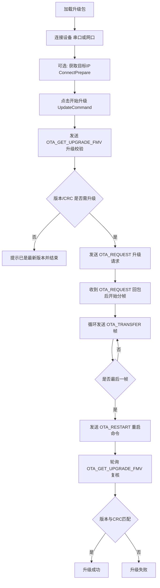

# OtaTool 模块说明

## 1. 模块定位

`OtaTool` 是用于设备固件升级（OTA）的工具模块，支持两种通信链路：

- 串口：`SerialPortService`
- UDP 网口：`NetUdpService`

核心能力：

- 加载升级包（zip）并解析升级元数据
- 查询目标设备状态与版本
- 发起升级、分帧传输、重启与升级后校验
- 支持中止升级
- 支持通过广播获取目标 IP（或超时后强制设置 IP）

---

## 2. 代码结构与职责

## 2.1 模块注册层

- `Modules/UtilityTools.Modules.OtaTool/OtaToolModule.cs`
  - 注册导航页：`OtaToolView`
  - 注册单例：`OtaModel`
  - 模块标题：`远程升级工具`

## 2.2 页面与 VM 层

- `Views/OtaToolView.xaml`
  - 顶部工具区：
    - 串口连接按钮（USB 图标）
    - 网口连接按钮（网线图标）
    - `获取目标IP` 按钮（`ConnectPrepareCommand`）
    - 目标端口输入框（默认 5001）
  - 主体挂载：`MainPageView`，`DataContext` 绑定 `OtaModel`

- `ViewModels/OtaToolViewModel.cs`
  - 负责 UI 层命令转发与连接弹窗
  - 关键命令：
    - `ShowDeviceCommand`：打开串口配置弹窗
    - `ShowNetDeviceCommand`：打开网口配置弹窗
    - `ConnectPrepareCommand`：广播查询/设置目标 IP，完成 UDP 目标配置

## 2.3 业务核心层

- `Model/OtaModel.cs`
  - OTA 升级主状态机
  - 管理升级包解析、升级状态、帧发送、超时控制、回包解析
  - 关键状态字段：
    - `_isUpdating`：是否处于升级流程
    - `_isStartUpgrade`：是否刚点击开始升级等待校验阶段
    - `_isRestart`：是否处于重启后校验阶段
    - `_isTimeout`：等待某一步回包的超时标记
    - `_fullSpeedSignalLight`：发包线程速度档（常速/高速）

## 2.4 协议层

- `Protocol/OtaProtocol.cs`
  - OTA 命令枚举与打包方法
  - 统一通过 `GetCmd(...)` 生成协议帧

- `Protocol/EthProtocol.cs`
  - 以太网辅助命令（获取/设置 IP）

---

## 3. UI 功能与对应命令

`MainPageView.xaml` 中的主要交互：

- `加载升级文件` 按钮 → `LoadPackFileCommand`
  - 读取 zip，解析 `DevelopmentBoardMessage.json` 和固件 bin
- `开始升级/停止升级` 按钮 → `UpdateCommand`
  - 开始时发升级校验请求
  - 再根据回包决定是否请求 OTA、传输、重启、复核
- `清除日志` 按钮 → `ClearLogCommand`
  - 清空 `Log`

显示项：

- 进度条：`CurFrameCount / MaxFrameCount`
- 状态：`Status`
- 提示：`Tips`
- 升级包信息：板卡类型、版本号、硬件版本、说明等

---

## 4. 升级流程（业务视角）

---

## 5. 指令清单（发送）

以下为模块实际会发送的指令（含触发场景）：

| 指令 | 枚举值 | 发送时机 | 代码位置 |
|---|---:|---|---|
| `OTA_GET_STATUS` | `0x0011` | 定时查询设备运行状态（2s） | `Timer_Elapsed` |
| `OTA_GET_UPGRADE_FMV` | `0x0010` | 开始升级前校验、重启后复核 | `Update()` / `ConfirmTheUpgradeTimer_Elapsed` |
| `OTA_REQUEST` | `0x0012` | 升级条件满足后，正式请求进入 OTA 传输 | `Parser_PacketReceivedEvent` |
| `OTA_TRANSFER` | `0x0014` | 逐帧发送固件数据（每帧 32 字节） | `OTA_REQUEST`/`OTA_TRANSFER` 回包分支 |
| `OTA_RESTART` | `0x0015` | 最后一帧完成后请求设备重启 | `OTA_TRANSFER` 回包分支 |
| `OTA_ABORT` | `0x0013` | 用户点击“停止升级”或超时失败时终止 | `Update()` / `ExecuteWithTimeoutAsync` |
| `CMD_GetIP` | `0x0632` | “获取目标IP”按钮广播查询目标 IP | `ConnectPrepare()` |
| `CMD_SetIP` | `0x0630` | 广播查询超时时，强制下发目标 IP | `ConnectPrepare()` |

> 说明：代码里还有 `OTA_GET_HWV`、`OTA_GET_FMV`、`OTA_SYS_BROADCAST` 的定义，但当前主流程未主动发送。

---

## 6. 回包处理逻辑（接收）

回包统一入口：`OtaModel.Parser_PacketReceivedEvent(...)`

- `OTA_GET_UPGRADE_FMV`
  - 解析设备版本与 CRC
  - 若处于重启后复核（`_isRestart=true`）：判断升级成功/失败
  - 若处于开始升级阶段（`_isStartUpgrade=true`）：判断是否需要升级，必要时发送 `OTA_REQUEST`
- `OTA_GET_STATUS`
  - `0x00` → `Status = 正常运行`
  - 非 `0x00` → `Status = 固件升级中`
- `OTA_REQUEST`
  - 设备同意升级后，从第 0 帧开始发送 `OTA_TRANSFER`
  - 打开高速发送标记 `_fullSpeedSignalLight = true`
- `OTA_TRANSFER`
  - 根据回包中的 `frameID` 继续发送下一帧
  - 最后一帧后发送 `OTA_RESTART`
- `OTA_RESTART`
  - 记录日志，等待后续复核流程完成
- `OTA_ABORT`
  - 复位状态，提示已停止升级

---

## 7. 升级文件处理

升级包由 `LoadPackFileCommand` 触发：

1. 用户选择 `*.zip`
2. 解压后读取 `DevelopmentBoardMessage.json`
3. 读取固件文件 `DevelopmentBoardMessage.FileName`
4. 固件按 32 字节对齐补齐到 `UpdateData`
5. 计算：
   - `MaxFrameCount = ceil(length / 32)`
   - `UpdateDataCrc = CRC16(UpdateData)`
6. 更新 UI：
   - 文件大小
   - 预计帧数
   - 升级包信息展示

---

## 8. 线程与定时器机制

- 发包线程：`SendMessageEnqueueThread`
  - 常速模式：每次发送后 `Sleep(200ms)`
  - 高速模式：不主动 sleep（用于传输阶段）
- 状态轮询定时器：`_timer`（2s）
  - 发 `OTA_GET_STATUS`
- 升级复核定时器：`_confirmTheUpgradeTimer`（500ms）
  - 发 `OTA_GET_UPGRADE_FMV`
- 超时守卫：`ExecuteWithTimeoutAsync(timeout)`
  - 传输阶段 5s
  - 重启复核阶段 10s

---

## 9. 关键风险点（阅读代码时建议重点关注）

- 双通道同时开启时，发送线程会同时向串口和网口发送相同数据；高速分支中有连续 `Dequeue`，若队列元素不足可能引发行为不一致，建议后续做统一发送策略。
- `FindIpv4IP()` 返回 `null` 的场景未做保护，网络环境异常时需增加兜底。
- 超时后的状态复位与 `OTA_ABORT` 发送存在多处分支，后续可统一收敛成单一终止路径。

---

## 10. 典型操作步骤（现场使用）

1. 打开 OTA 页面，连接串口或网口
2. 点击“加载升级文件”，确认包信息无误
3. （可选）点击“获取目标IP”，完成设备 IP 准备
4. 点击“开始升级”
5. 观察进度条与日志
6. 升级结束后查看 `Tips` 与日志中的版本/CRC复核结果

---

## 11. 关联文件索引

- `Modules/UtilityTools.Modules.OtaTool/OtaToolModule.cs`
- `Modules/UtilityTools.Modules.OtaTool/Views/OtaToolView.xaml`
- `Modules/UtilityTools.Modules.OtaTool/Views/MainPageView.xaml`
- `Modules/UtilityTools.Modules.OtaTool/ViewModels/OtaToolViewModel.cs`
- `Modules/UtilityTools.Modules.OtaTool/Model/OtaModel.cs`
- `Modules/UtilityTools.Modules.OtaTool/Protocol/OtaProtocol.cs`
- `Modules/UtilityTools.Modules.OtaTool/Protocol/EthProtocol.cs`
- `Modules/UtilityTools.Modules.OtaTool/Model/CommonModel.cs`
