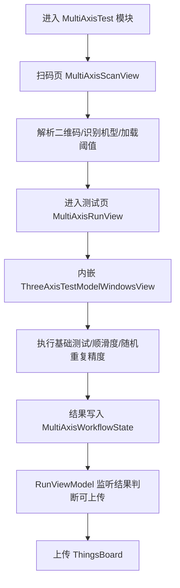
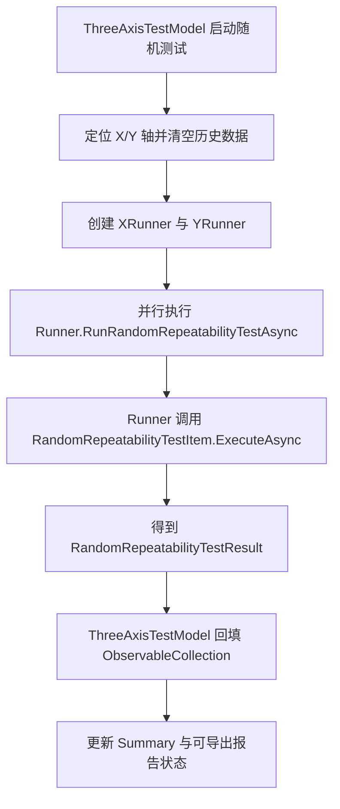

# 多轴测试项目说明

## 1. 项目目标

`MultiAxisTest` 模块用于“扫码识别样品台 -> 进入电机测试 -> 汇总并上传结果”的整套流程。  
测试执行层复用了 `MotorTest` 模块（包含三轴/五轴窗口与各类 TestItem），并通过共享状态对象 `MultiAxisWorkflowState` 实现数据贯通。

---

## 2. 目录与职责

## 2.1 MultiAxisTest 模块

- `Modules/UtilityTools.Modules.MultiAxisTest/MultiAxisTestModule.cs`
  - 注册模块入口 `MultiAxisTestView`
  - 注册扫描页 `MultiAxisScanView`
  - 注册测试页 `MultiAxisRunView`
  - 注册单例 `MultiAxisWorkflowState`，并把它注册为 `ITestReportService`（供测试层写报告）

- `ViewModels/MultiAxisScanViewModel.cs`
  - 处理扫码解析、机型识别、阈值配置、无扫码调试入口
  - 负责进入测试页的前置条件控制

- `ViewModels/MultiAxisRunViewModel.cs`
  - 监听测试结果事件，判断“是否允许上传”
  - 执行上传到云端（ThingsBoard）
  - 支持返回扫码页并重置本轮状态

- `Model/MultiAxisWorkflowState.cs`
  - 共享流程状态（扫码信息、机型、最终上传对象）
  - 实现 `ITestReportService`：`StartReport/InitReport/AddOrUpdateMotorData/CompleteReport`

- `Views/MultiAxisRunView.xaml`
  - 内嵌 `MotorTest` 的 `ThreeAxisTestModelWindowsView`
  - 顶部提供“返回”和“提交测试数据”按钮

## 2.2 MotorTest 复用层（关键）

- `Modules/UtilityTools.Modules.MotorTest/Model/ThreeAxisTestModel.cs`
  - 承载测试命令、图表、日志、随机重复精度测试入口

- `Modules/UtilityTools.Modules.MotorTest/Runners/MotorWorkflowRunner.cs`
  - 基础测试、顺滑度测试、随机重复精度等“调度器（Runner）”流程

- `Modules/UtilityTools.Modules.MotorTest/TestItems/RandomRepeatabilityTestItem.cs`
  - 随机重复精度测试核心算法与执行细节（单轴）

---

## 3. 全流程概览

---

## 4. 测试执行与数据上报关系

1. `MultiAxisTestModule` 将 `MultiAxisWorkflowState` 注入为 `ITestReportService`。  
2. `ThreeAxisTestModel` 内部通过 `ITestReportService` 写测试报告。  
3. `MotorWorkflowRunner` 在测试过程中发布 `MotorTestResultEvent`（UI 和上传条件都依赖它）。  
4. `MultiAxisRunViewModel` 监听事件：
   - 某轴出现 `Failed` -> 禁止上传
   - 轴的“顺滑度测试”通过（视为该轴基础测试完结）-> 标记该轴完成
   - 所有已记录轴都通过 -> `CanUpload = true`

## 4.1 首次连接固件检查（新增）

- 触发点：首次串口/网口连接成功后（同一测试周期仅检查一次）。
- 独立流程类：`Modules/UtilityTools.Modules.MultiAxisTest/Services/MultiAxisFirmwareUpgradeFlow.cs`
  - 该类在多轴模块内重写“检查+升级”流程；
  - 仅复用 OTA 协议命令定义，不复用 `OtaModel` 的现有流程代码。
- 检查流程：
  1. 从固件目录 `http://60.173.16.125:9090/.../固件/` 抓取最新 zip。
  2. 解析包内 `DevelopmentBoardMessage.json`，获取目标 `DeviceID`、版本号与固件数据 CRC。
  3. 发送 `OTA_GET_UPGRADE_FMV` 读取当前控制板版本/CRC。
  4. 比对后若非最新，弹人工确认框：`立即升级` / `暂不升级`。
- 升级策略：**默认不自动升级**，仅在人工确认后执行 OTA。
- 升级执行：复用 OTA 指令序列 `OTA_REQUEST -> OTA_TRANSFER(逐帧) -> OTA_RESTART -> 版本复核`。
- 状态落地：结果写入 `MultiAxisWorkflowState` 的固件检查字段（是否已检查、是否需升级、当前/最新版本、最新包地址、提示信息）。

---

## 5. 随机重复精度测试（详细）

本节重点说明你关心的“随机测试”。

## 5.1 入口与调度方式

当前已是 **Runner 调度模式**（不是旧的内联直调）：

- 入口：`ThreeAxisTestModel.StartRandomRepeatabilityTest`
- 在 `RunRandomRepeatabilityTestAsync(token)` 中：
  - 找到 `X/Y` 两轴
  - 分别创建 `MotorWorkflowRunner`（每轴一个）
  - 并行调用 `RunRandomRepeatabilityTestAsync(...)`
  - 等待完成后回填 UI 集合（点表、行程表、统计、直方图）

流程图：

## 5.2 单轴测试算法步骤（TestItem 内部）

`RandomRepeatabilityTestItem.ExecuteAsync(...)` 主要步骤：

1. **参数校验**
   - 要求 `SubRatio > 0`

2. **满行程检测**
   - 调用 `FullTravelTestItem` 获取单轴 `minUm/maxUm`
   - 检测失败时尝试降级；范围无效则终止

3. **随机点生成**
   - 以行程中心生成高斯分布目标点（Box-Muller）
   - 点数约为 `travelUm / spacingUm`
   - 脉冲值限制在 `[minPulse, maxPulse]`

4. **电机准备**
   - 切闭环位置模式、使能、运行

5. **随机跳转循环**
   - 每轮对随机点打乱顺序
   - 下发 GOTO
   - 两段判停（离开 stop -> 回到 stop）
   - 记录每次行程：起点、终点、耗时、距离、平均速度

6. **统计与直方图**
   - 计算每个目标点的均值/标准差
   - 计算 `AvgStdX`、平均移动时间
   - 生成距离直方图与速度直方图

7. **返回结果**
   - `RandomRepeatabilityTestResult`

## 5.3 随机测试相关“发指令”清单（重点）

随机测试实际会触发以下电机命令（通过 `IMotorEntity`）：

| 阶段 | 方法 | 指令含义 |
|---|---|---|
| 满行程检测 | `FullTravelTestItem.ExecuteAsync(...)` 内部 | 往返扫描行程与限位（会发运动/状态相关指令） |
| 准备阶段 | `SetMotorControlModeCommand(..., CloseLoopPosCtr)` | 切闭环位置模式 |
| 准备阶段 | `SetMotorEnableCommand(..., Enable)` | 电机使能 |
| 准备阶段 | `SetMotorOperatingStatusCommand(..., Run)` | 进入运行状态 |
| 跳转阶段 | `SetMotorGoToCommand(..., Pulse, targetPulse)` | 下发目标点 GOTO |

> 注意：随机测试本身不直接设置软限位参数；软限位控制依赖当前轴既有配置与满行程阶段行为。

## 5.4 进度与日志

- `RandomRepeatabilityTestItem` 支持 `progressReporter`
- `ThreeAxisTestModel` 把进度格式化为：
  - 完成数/总数
  - 百分比
  - 已用时间
  - 预计剩余时间
- 日志分别写入 `X/Y` 轴对应日志区，便于现场排障

## 5.5 结果对象字段（现场关注）

`RandomRepeatabilityTestResult` 重点字段：

- `IsPassed`：是否通过
- `IsTestCompleted`：是否完整执行完
- `ErrorDescription`：失败原因（超时/指令失败/参数异常等）
- `AvgStdX`：单轴平均重复精度标准差（μm）
- `MoveTripsX`：每次跳转明细
- `PointStatsX`：按目标点聚合统计
- `DistanceHistogramX`、`SpeedHistogramX`：分布图数据

---

## 6. 与“基础测试”的关系

在当前体系中：

- 随机重复精度测试是独立命令，不参与 `CanUpload` 的放行判断
- `CanUpload` 依赖基础测试链路的完结（以“顺滑度测试”通过作为某轴完成标记）

如果后续你希望“随机测试必须通过才能上传”，可以在 `MultiAxisRunViewModel.OnMotorTestResult(...)` 增加对 `TestProject == 随机坐标重复精度测试` 的门禁规则。

---

## 7. 上传流程说明

`MultiAxisRunViewModel.UploadData()`：

1. 从 `_state.GetFinalReport()` 取最终对象
2. 读取 ThingsBoard 配置并写入 `DeviceId`
3. 序列化为 JSON
4. 调用 `_thingboardService.UploadTelemetryAsync(jsonPayload)` 上传
5. 成功/失败通过弹窗展示

---

## 8. 常见问题与排查建议

- **随机测试提示行程过小**
  - 检查轴满行程是否正确测出；确认 `SubRatio` 合法

- **随机测试中途超时未停止**
  - 查看电机状态回包刷新是否正常
  - 检查目标脉冲是否越界（限位/行程配置）

- **能测完但上传按钮不亮**
  - 看是否有任一轴出现 `Failed`
  - 看最后“顺滑度测试”是否通过并上报事件

- **上传失败**
  - 校验 ThingsBoard 配置
  - 查看上传失败弹窗中的具体错误信息

---

## 9. 建议后续优化

1. 将随机测试纳入上传门禁可配置项（按机型启用）
2. 在 UI 增加“随机测试当前指令/当前点位”实时显示
3. 将随机测试结果结构与上传 JSON 显式映射（目前更偏 UI 展示）
4. 增加“随机测试重试策略”（单点失败可跳过并统计降级结果）
