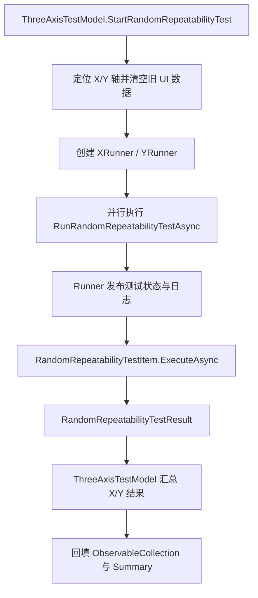
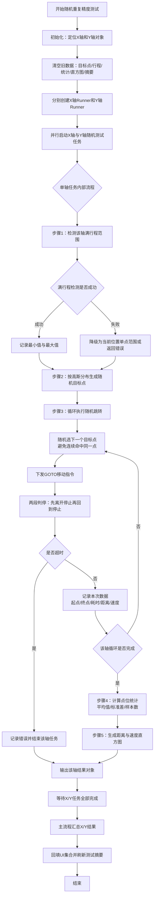

# 随机坐标重复精度测试改造说明

## 1. 改造目的

将原有的随机坐标重复精度测试从 `ThreeAxisTestModel.cs` 中的内联实现改造成符合项目规范的独立 `TestItem` 类，使其与其他测试模块保持一致的结构和风格。

## 2. 创建的新文件

### 2.1 RandomRepeatabilityTestResult.cs
**位置**：`Modules\UtilityTools.Modules.MotorTest\Model\RandomRepeatabilityTestResult.cs`

**作用**：定义随机坐标重复精度测试的结果数据结构

**主要类**：
- `RandomRepeatabilityTestResult`：测试结果主类，继承自 `MotorTestResult`
  - 包含所有测试数据的集合属性（使用 `ObservableCollection` 以支持 UI 绑定）
  - 包含测试统计数据（平均标准差、平均移动时间等）
  - 包含测试完成状态标志

**数据集合**：
- `TargetPoints`：目标点列表
- `MoveTripsX/Y`：X/Y轴行程记录
- `PointStatsX/Y`：X/Y轴统计数据
- `DistanceHistogramX/Y`：X/Y轴距离直方图
- `SpeedHistogramX/Y`：X/Y轴速度直方图

### 2.2 RandomRepeatabilityTestItem.cs
**位置**：`Modules\UtilityTools.Modules.MotorTest\TestItems\RandomRepeatabilityTestItem.cs`

**作用**：实现随机坐标重复精度测试的核心逻辑

**主要类**：
- `RandomRepeatabilityTestItem`：测试类，实现 `IMotorTestItem` 接口
  - 提供单轴测试方法（符合接口规范）
  - 封装完整的测试流程

**构造函数参数**：
- `spacingUm`：点间距（微米），默认 5000（5mm）
- `repeatsPerPoint`：每点重复次数，默认 10
- `histogramBins`：直方图 bin 数，默认 10

## 3. 修改的文件

### 3.1 ThreeAxisTestModel.cs
**位置**：`Modules\UtilityTools.Modules.MotorTest\Model\ThreeAxisTestModel.cs`

**主要修改**：
1. **重构 `RunRandomRepeatabilityTestAsync` 方法**：
   - 使用新的 `RandomRepeatabilityTestItem` 类执行测试
   - 从测试结果中获取数据并更新 UI 集合
   - 添加异常处理逻辑

2. **删除旧的内联实现**：
   - 删除了原有的满行程检测、随机点生成、跳转测试等内联代码
   - 删除了相关的辅助方法（`GenerateGaussianPoints`、`NextGaussian` 等）

3. **保留必要的辅助方法**：
   - `TryRandomAxisLeaveThenStopAsync`：等待电机停止的方法
   - `AppendRandomRepeatLog`：日志记录方法

## 4. 实现的功能

### 4.1 满行程检测
**实现位置**：`RandomRepeatabilityTestItem.MeasureAxisFullTravelUmAsync()`

**功能**：
- 调用 `FullTravelTestItem` 检测单轴的满行程范围
- 支持检测失败时的降级处理
- 返回轴的最小和最大位置（微米）

**异常处理**：
- 如果检测失败，使用当前位置作为单点范围
- 检测失败且范围无效时，测试会返回错误

### 4.2 高斯分布随机点生成
**实现位置**：`RandomRepeatabilityTestItem.GenerateGaussianPoints()`

**功能**：
- 以单轴中心为原点生成高斯分布的随机点
- 根据实际行程范围计算点数密度
- 确保生成的点在有效行程范围内

**算法**：
- 使用 Box-Muller 变换生成高斯分布随机数
- 标准差 σ = max(spacing, spacing * √N / 3)
- 脉冲值限制在 [minPulse, maxPulse] 范围内

### 4.3 随机跳转测试
**实现位置**：`RandomRepeatabilityTestItem.ExecuteAsync()` 主循环

**功能**：
- 在随机点之间进行跳转
- 每个点重复指定次数
- 记录每次跳转的详细数据

**测试流程**：
1. 随机选择下一个目标点（避免连续跳转到同一点）
2. 下发 GOTO 指令到单轴
3. 等待电机到位（两段判停：离开停止状态 → 回到停止状态）
4. 记录起点、终点、耗时、距离、速度等数据
5. 如果轴超时，测试会返回错误

### 4.4 数据统计分析
**实现位置**：`RandomRepeatabilityTestItem.BuildRepeatabilityAxisStats()`

**功能**：
- 计算每个目标点的重复精度统计
- 计算平均值和标准差
- 生成单轴的统计数据

**统计指标**：
- `MeanUm`：实际位置的平均值
- `StdUm`：实际位置的标准差（重复精度）
- `SampleCount`：样本数量

### 4.5 直方图生成
**实现位置**：`RandomRepeatabilityTestItem.BuildHistogram()`

**功能**：
- 生成距离和速度的分布直方图
- 自动计算 bin 宽度
- 处理边界情况（所有值相同）

**直方图类型**：
- 距离直方图：每次跳转的距离分布
- 速度直方图：每次跳转的平均速度分布

## 5. 代码结构和设计

### 5.1 设计模式
- **策略模式**：`IMotorTestItem` 接口定义测试策略
- **单一职责原则**：每个类只负责一个功能
- **依赖注入**：通过构造函数注入依赖项

### 5.2 数据流（已切换为 Runner 调度）
```
ThreeAxisTestModel
    ↓ 创建并调度 X/Y 两个 Runner
MotorWorkflowRunner (X轴 / Y轴)
    ↓ 调用 TestItem
RandomRepeatabilityTestItem
    ↓ 返回结果对象
RandomRepeatabilityTestResult
    ↓ 汇总并回填
ThreeAxisTestModel
    ↓ 更新 UI
ObservableCollection (UI 绑定)
```

### 5.3 流程图（Runner 版本）


### 5.3.1 流程图（全中文详细版：怎么做）


**按执行顺序说明（全中文）**：
1. **入口触发**：在 `ThreeAxisTestModel` 中启动随机重复精度测试。
2. **准备阶段**：先拿到 X/Y 两轴对象，并清空上一次测试残留的 UI 数据。
3. **创建调度器**：为每个轴创建一个 `MotorWorkflowRunner`，让两轴可以并行执行。
4. **单轴检测范围**：每个轴先做满行程检测，得到可运动区间；若失败则按降级策略处理，必要时直接报错返回。
5. **生成随机点**：基于该轴行程范围和点间距，按高斯分布生成目标点集合。
6. **随机跳转循环**：每轮随机选择目标点，下发 GOTO，等待“离停→回停”两段判停，随后记录本次行程与速度等数据。
7. **超时与异常处理**：如果某轮等待超时，当前轴会写入错误信息并结束该轴流程，避免无休止等待。
8. **结果统计**：循环结束后，计算点位统计（均值、标准差、样本数），并构建距离/速度直方图。
9. **双轴汇总回填**：主流程等待 X/Y 都结束，再把结果回填到 `ObservableCollection`，并更新摘要文本。

### 5.4 异常处理
- **OperationCanceledException**：向上传播，表示测试被取消
- **其他异常**：捕获并设置错误描述，不中断程序
- **超时处理**：返回 false，允许继续测试其他轴

### 5.5 线程安全
- 使用 `CancellationToken` 支持测试取消
- 使用 `ConfigureAwait(false)` 避免死锁
- 所有异步操作都正确使用 `await`

## 6. 使用方法

### 6.1 在 ThreeAxisTestModel 中通过 Runner 调用
```csharp
// 创建调度器（每轴一个）
var xRunner = new MotorWorkflowRunner(
    _reportService, _eventAggregator, MotorEntity,
    xAxis.EnumMotorId,
    xAxis.MotorModel,
    xAxis.FullStrokeRange,
    xAxis.Name);
var yRunner = new MotorWorkflowRunner(
    _reportService, _eventAggregator, MotorEntity,
    yAxis.EnumMotorId,
    yAxis.MotorModel,
    yAxis.FullStrokeRange,
    yAxis.Name);

// 并行执行
var xTask = xRunner.RunRandomRepeatabilityTestAsync(
    (completed, total, elapsed, eta) =>
        AppendRandomRepeatProgressLog(xAxis, completed, total, elapsed, eta),
    token);
var yTask = yRunner.RunRandomRepeatabilityTestAsync(
    (completed, total, elapsed, eta) =>
        AppendRandomRepeatProgressLog(yAxis, completed, total, elapsed, eta),
    token);

await Task.WhenAll(xTask, yTask);
var xResult = xTask.Result;
var yResult = yTask.Result;

// 更新 UI 数据 - X轴
foreach (var point in xResult.TargetPoints)
    RandomTargetPoints.Add(point);
foreach (var trip in xResult.MoveTripsX)
    RandomMoveTripsX.Add(trip);
foreach (var stat in xResult.PointStatsX)
    RandomPointStatsX.Add(stat);
foreach (var bin in xResult.DistanceHistogramX)
    RandomDistanceHistogramX.Add(bin);
foreach (var bin in xResult.SpeedHistogramX)
    RandomSpeedHistogramX.Add(bin);

// 更新 UI 数据 - Y轴
foreach (var point in yResult.TargetPoints)
    RandomTargetPoints.Add(point);
foreach (var trip in yResult.MoveTripsX)
    RandomMoveTripsY.Add(trip);
foreach (var stat in yResult.PointStatsX)
    RandomPointStatsY.Add(stat);
foreach (var bin in yResult.DistanceHistogramX)
    RandomDistanceHistogramY.Add(bin);
foreach (var bin in yResult.SpeedHistogramX)
    RandomSpeedHistogramY.Add(bin);

// 显示测试摘要
RandomRepeatabilitySummary = $"完成：X轴标准差={xResult?.AvgStdX:F3} μm，Y轴标准差={yResult?.AvgStdX:F3} μm";
```

### 6.2 自定义测试参数
```csharp
// 自定义点间距、重复次数、直方图 bin 数
var testItem = new RandomRepeatabilityTestItem(
    spacingUm: 3000,      // 3mm 点间距
    repeatsPerPoint: 15,  // 每点 15 次
    histogramBins: 15);    // 15 个 bin
```

## 7. 测试结果解读

### 7.1 重复精度标准差
- **X轴平均标准差**：`AvgStdX`
- **Y轴平均标准差**：`AvgStdY`
- 数值越小，重复精度越高

### 7.2 测试完成条件
- `IsTestCompleted = true`：测试正常完成
- `IsTestCompleted = false`：测试未完成，查看 `ErrorDescription`

### 7.3 数据记录
- **行程记录**：每次跳转的详细信息（序号、起点、终点、耗时、距离、速度）
- **点统计**：每个目标点的重复精度统计
- **直方图**：距离和速度的分布情况

## 8. 与其他测试的对比

### 8.1 优势
- **规范化**：符合项目的 `TestItem` 架构
- **可重用**：可以在其他地方复用测试逻辑
- **可测试**：独立的类便于单元测试
- **可维护**：逻辑清晰，易于修改和扩展

### 8.2 与其他 TestItem 的一致性
- 实现相同的 `IMotorTestItem` 接口
- 返回继承自 `MotorTestResult` 的结果类
- 使用相同的异常处理模式
- 遵循相同的命名规范

## 9. 注意事项

### 9.1 性能考虑
- 随机点数量 = X轴点数 × Y轴点数
- 总跳转次数 = 随机点数量 × 重复次数
- 测试时间与总跳转次数成正比

### 9.2 限制条件
- 满行程 ≥ 点间距
- 如果满行程检测失败且范围无效，测试无法进行
- 轴超时时，测试会返回错误

### 9.3 精度要求
- 需要电机的 `SubRatio`（换算系数）> 0
- 需要电机支持闭环位置控制
- 需要电机支持 GOTO 指令

## 10. 未来扩展方向

### 10.1 功能扩展
- 支持自定义点分布算法（均匀分布、泊松分布等）
- 支持多轴测试（3轴、4轴、5轴）
- 支持测试参数的 UI 配置

### 10.2 性能优化
- 并行化随机点生成
- 优化直方图计算算法
- 减少不必要的内存分配

### 10.3 数据持久化
- 支持测试结果保存到数据库
- 支持测试结果导出为 CSV/Excel
- 支持测试历史记录查询